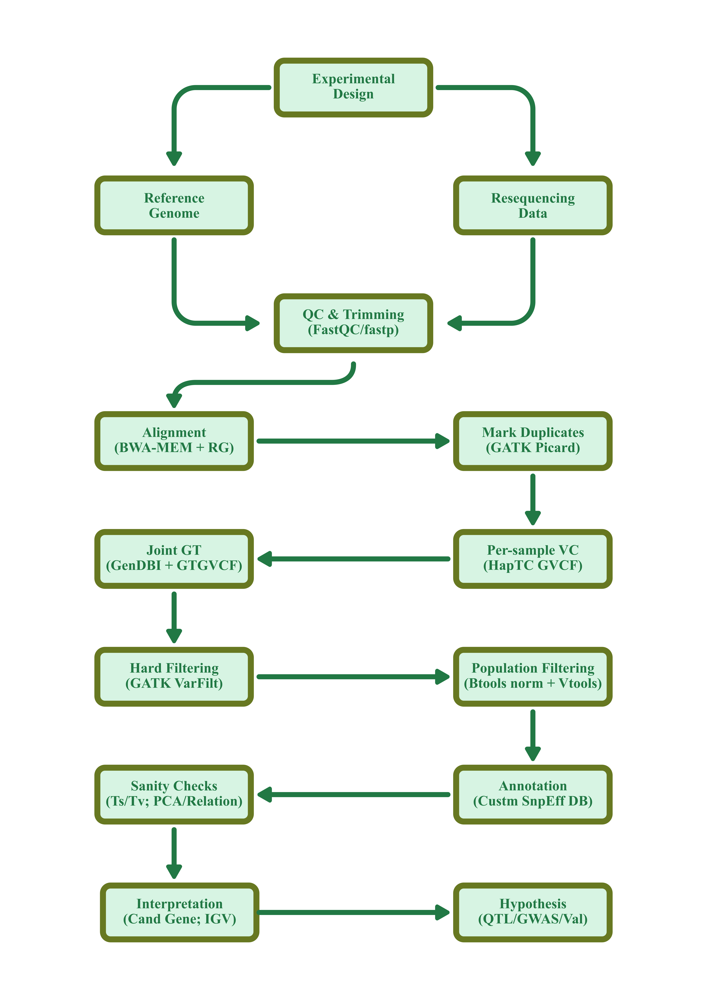

# From Field to FASTA to Function
### A Hands-On Variant Discovery Tutorial Using Cowpea (*Vigna unguiculata*), an African Orphan Legume

**Audience:** plant breeders and agricultural scientists comfortable navigating Linux, but not necessarily fluent in bioinformatics pipeline design.
**Environment:** a shared Linux HPC cluster with a SLURM scheduler, `conda`/`mamba`, and standard internet egress (or an offline mirror of the data described in Module 3).
---

## Table of Contents

1. [Why This Tutorial, Why Cowpea](#1-why-this-tutorial-why-cowpea)
2. [Learning Objectives & Schedule](#2-learning-objectives--schedule)
3. [Module 1 — Experimental Design for Variant Discovery](#module-1--experimental-design-for-variant-discovery)
4. [Module 2 — HPC Environment & Software Setup](#module-2--hpc-environment--software-setup)
5. [Module 3 — Data Acquisition](#module-3--data-acquisition)
6. [Module 4 — Raw Read Quality Control & Trimming](#module-4--raw-read-quality-control--trimming)
7. [Module 5 — Read Alignment to the Reference Genome](#module-5--read-alignment-to-the-reference-genome)
8. [Module 6 — Post-Alignment Processing & QC](#module-6--post-alignment-processing--qc)
9. [Module 7 — Variant Calling](#module-7--variant-calling)
10. [Module 8 — Joint Genotyping & Variant Filtering](#module-8--joint-genotyping--variant-filtering)
11. [Module 9 — Population-Level Sanity Checks](#module-9--population-level-sanity-checks)
12. [Module 10 — Variant Annotation](#module-10--variant-annotation)
13. [Module 11 — Biological Interpretation: From VCF to Candidate Gene](#module-11--biological-interpretation-from-vcf-to-candidate-gene)
14. [Pipeline Recap Diagram](#pipeline-recap-diagram)
15. [Generalising Beyond Cowpea](#generalising-beyond-cowpea)
16. [Glossary for Plant Breeders](#glossary-for-plant-breeders)
17. [References & Further Reading](#references--further-reading)
18. [Appendix A — Consolidated Scripts](#appendix-a--consolidated-scripts)
19. [Appendix B — Troubleshooting FAQ](#appendix-b--troubleshooting-faq)
20. [Appendix C — `environment.yml`](#appendix-c--environmentyml)

---

## 1. Why This Tutorial, Why Cowpea

"Orphan crops" — cowpea, finger millet, tef, bambara groundnut, fonio, pearl millet, and dozens of others — feed hundreds of millions of people but have historically received a tiny fraction of the genomic investment given to maize, rice, wheat, or soybean. That gap is closing, but it means two things for anyone doing variant discovery in these species:

1. **The standard "GATK Best Practices" playbook was written with human/maize-scale resources in mind** — deep truth sets of known variants, population reference panels, and mature annotation databases. Orphan crops usually have *none* of these. We will customise around these constraints.
2. **Real, usable public data exists for a growing number of orphan crops**, and learning to find, vet, and use it is itself a core skill; experiencing the friction of real data (inconsistent metadata, no known-sites VCF, imperfect reference annotation) is the hope.

We use **cowpea (*Vigna unguiculata* [L.] Walp.)** as the model orphan crop because it workshop:

| Property | Cowpea | Rationale                                                                                                                                                                      |
|---|---|--------------------------------------------------------------------------------------------------------------------------------------------------------------------------------|
| Genome size | ~519 Mb assembled (1C ≈ 640 Mb) | Small enough to align/call variants on a training HPC allocation within hours, not days                                                                                        |
| Ploidy | Diploid, 2n = 22 | No polyploidy-aware calling complications (we discuss this in [Generalizing Beyond Cowpea](#generalizing-beyond-cowpea) for tetraploid orphan crops like tef or finger millet) |
| Reference genome | Chromosome-scale, annotated: **IT97K-499-35 vQnBW** (Lonardi *et al.* 2019, *Plant J.*; Liang *et al.* 2024 pan-genome update) | A real high-quality reference — not every orphan crop has this                                                                                                                 |
| Public resequencing data | 37 diverse samples/accessions WGS (Muñoz-Amatriaín *et al.* 2017), archived under NCBI SRA study **SRP077082** | Gives us a genuine multi-sample diversity panel to joint-call, exactly like a real diversity-panel resequencing project                                                        |
| Agronomic relevance | Primary protein source across sub-Saharan Africa; drought-tolerant; devastated across the Sudano-Sahelian zone by the parasitic weeds *Striga gesnerioides* and *Alectra vogelii* | Has a desired trait to model the training on                                                                                                                                   |

### Our running biological question

The reference accession **IT97K-499-35** is itself part of a Striga/Alectra-resistant pedigree used at IITA. It has a large ~4.2 Mb chromosomal inversion on chromosome **Vu03** that is present in most Striga-resistant breeding lines. It contains a candidate gene — ***Vigun03g220400***, a sulfotransferase homologous to the sorghum Striga-resistance gene *Sobic.005G213600* — as biologically plausible, though not yet functionally confirmed. Independent GWAS work has also implicated defence/immune-signalling genes near Striga-resistance QTL peaks on chromosomes Vu02, Vu07, Vu10 and Vu11.

We will use this as our **worked discovery model**: by the end of the tutorial you will have called and annotated real variants across a diverse cowpea panel and be able to ask, for yourself, "does variation at *Vigun03g220400* and its neighbours correspond with what's known about Striga resistance in these samples/accessions?" That is a typical hypothesis-generating question variant discovery is good for — and precisely where it stops and proper QTL mapping / functional validation must begin.

---

## 2. Learning Objectives & Schedule

By the end of this tutorial you will be able to:

- Design a sequencing experiment for variant discovery in a species with limited genomic resources
- Justify tool choices in a variant-calling pipeline
- Run a full short-read variant discovery workflow on an HPC cluster: QC → alignment → calling → joint genotyping → filtering → annotation
- Adapt GATK "Best Practices" for a species with no truth/training variant sets
- Interpret a population VCF in the context of a real breeding question, and know the difference between "candidate gene" and "confirmed causal gene"

### Suggested schedule

- **Morning 1:** Modules 1–2 (design + HPC setup) using slides/discussion only; Module 3 data already pre-staged by instructors
- **Midday 1:** Modules 4–5 on a **pre-subsampled, 2-accession, single-chromosome** dataset
- **Afternoon 1:** Modules 6–7, hard filtering shortcuts pre-computed for slow steps
- **Afternoon 2:** Module 10 (annotation) abbreviated to one chromosome; Module 11 discussion

> **Design rationale:** This is a workshop setting that is time-constrained, therefore, the intellectual integrity is maintained, but within a **restricting genomic scope**, not skipping steps. That is, we restrict to chromosome **Vu03** (which conveniently also carries our candidate Striga-resistance region) plus a small flanking set, and to a **handful of samples/accessions** rather than all 37. Every command below scales trivially back up to the full genome/panel.

---

## Module 1 — Experimental Design for Variant Discovery

Before working on any genomic data, you must understand the design behind its generation. Conversely, you must think about the bioinformatics analyses/question *before* touching a sequencer.

### 1.1 Defining the question precisely

"Find variants related to drought tolerance" is not an experimental design; it's a wish.

A workable version: *"Among cultivated cowpea samples/accessions with contrasting Striga gesnerioides response, which SNPs/indels are consistently differentiated near known resistance-associated loci on Vu03, Vu07, Vu10 and Vu11?"* Notice this version already implies:
- a population structure
- a genomic scope
- an analysis plan

### 1.2 Choosing your population structure

| Design | Best for | Trade-off |
|---|---|---|
| **Biparental (RIL/F2/BC)** | Clean QTL mapping of one trait segregating between two known parents | Only samples the allelic diversity of two parents; slow to develop (multiple generations) |
| **Diversity panel / germplasm collection** (what we use here) | Broad variant *discovery*, allele mining across a gene pool, GWAS if phenotyped | Confounded by population structure/relatedness — must be corrected for statistically; rarer alleles need larger panels |
| **MAGIC / NAM** | Combines multi-parent diversity with QTL-mapping resolution | Long, expensive population development; overkill for a discovery-stage tutorial |

> **Our use case:** We use a **diversity panel** here (the 37-accession WGS set from Muñoz-Amatriaín *et al.* 2017) because our goal is *discovery* across the species' gene pool, not fine-mapping one cross.

### 1.3 Choosing a sequencing strategy

| Strategy                                                                            | Depth needed                                                                                    | Cost/sample | Captures | When to choose it |
|-------------------------------------------------------------------------------------|-------------------------------------------------------------------------------------------------|---|---|---|
| **Whole-genome resequencing (WGS), short-read** *(this tutorial)*                   | 10–15X for population SNP/indel calling; 30X+ if you need one high-confidence individual genome | $$ | SNPs, small indels, some CNVs/SVs, genome-wide | Default choice for variant discovery when you have a good reference and moderate budget |
| **Genotyping-by-sequencing (GBS) / Restriction site-associated DNA (RAD)-seq**      | Very low per-locus depth, reduced representation                                                | $ | A sparse, reproducible subset of SNPs | Large panels (hundreds–thousands) where per-sample cost dominates and you only need enough markers for structure/GWAS, not exhaustive variant discovery |
| **Exome/target capture**                                                            | 30–50X on captured regions                                                                      | $$ | Coding-region variants only | Species with poor genome assembly but a decent gene set, or when you specifically care about coding change |
| **Low-coverage WGS + imputation** (1–4X, many samples, genotype-likelihood methods) | 1–4X                                                                                            | $ | Genome-wide, statistically inferred | Very large panels where you trade per-sample certainty for population-scale power (needs a good haplotype reference panel, which most orphan crops still lack — a real limitation) |
| **Long-read (PacBio HiFi / ONT)**                                                   | 15–30X                                                                                          | $$$$ | Structural variants, repeats, phasing, presence/absence variation | Reference genome construction, pan-genome studies, or when SVs are the trait of interest — not the default for routine SNP discovery in a diploid with an existing reference |

**Design choice made here:** short-read WGS at moderate depth, because:
1. Good chromosome-scale reference already exists for cowpea
2. Our question is about SNPs/small indels near candidate genes, not structural variation
3. It lets us teach the exact same GATK/bcftools workflow that transfers directly to almost any other diploid orphan crop with a reference genome.

**Platform note:** Illumina paired-end 150 bp remains the practical default for this workflow (lowest per-base error rate, cheapest per-Gb, best tool support for the aligners/callers below). PacBio HiFi or ONT would be the better choice if the trait of interest is a presence/absence variant, a large inversion (note we *do* have one of those near our candidate gene!), or if the reference itself needs improving — but that is out of this workshop's scope.

### 1.4 Depth-of-coverage reasoning

Coverage need is a function of **what** you're calling and **how confident** you need to be at each site:

- Confidently calling a **heterozygous** SNP needs enough reads to see both alleles — below ~8–10X you start losing heterozygous calls to sampling noise (a real risk in cowpea, which self-pollinates predominantly but is not perfectly inbred).
- Population/joint calling (Module 8) borrows statistical strength across samples, so **10–15X per sample/accession is a defensible, budget-conscious target** for a diversity panel — this is the density used in several published cowpea WGS-based GWAS efforts.
- If your real goal were **structural variant** or **presence/absence variant** discovery (increasingly important in cowpea given its published pan-genome), you would budget for 20–30X+ and seriously consider long reads instead.

### 1.5 Library prep & batch design considerations

- **Insert size** ~350–550 bp for standard paired-end WGS; record it, it matters for downstream tools that estimate fragment size (duplicate marking, some SV callers).
- Prefer **PCR-free or PCR-minimised library prep** where budget allows — it measurably reduces duplicate rate and GC-bias, both of which bite you at the variant-calling stage.
- **Never confound sequencing batch/lane with your biological grouping of interest.** If you plan to compare "Striga-resistant" vs "Striga-susceptible" samples/accessions, spread both groups across sequencing runs/flow cells. Otherwise, a batch effect will masquerade as a trait-associated signal — a classic and entirely avoidable false positive.
- Keep a **sample sheet** from day one (see template below). Every sample/accession needs, at minimum: sample/accession ID, passport/origin, phenotype score(s), DNA QC metrics (concentration, 260/280, gel image reference), and the SRA/library ID once sequenced.

```text
accession_id    origin          striga_response   dna_conc_ngul  library_id     sra_run
IT97K-499-35    Nigeria (IITA)  Resistant (ref)   142            LIBREF01       (reference genome sample, not a resequencing run)
TVu-xxxxx       Burkina Faso    Susceptible (lit)  98             LIB02          SRRxxxxxxx
...
```

### 1.6 Reference genome fitness-for-purpose

Before committing to a reference, ask:
- Is it **chromosome-scale** or a fragmented scaffold pile? (IT97K-499-35 vQnBW is chromosome-scale: 11 pseudomolecules.)
- How genetically distant is it from your panel? A reference from a Striga-*resistant* elite line, used to call variants in a panel that includes wild/landrace *susceptible* material, will systematically under-call variants in regions where the panel diverges most from the reference — worth knowing before you interpret an apparent "lack of variation".
- Is there a **pan-genome** available? Cowpea now has one (Liang *et al.* 2024, CowpeaPan) — a single linear reference will always miss presence/absence variation relative to it. We use the single reference here because it is the tractable teaching case, but a working breeder should know the pan-genome resource exists.

### 1.7 Data management plan (do this now, not after)

- Decide a folder/file naming convention before sequencing starts (see Module 2).
- Plan to deposit raw reads in SRA/ENA under a BioProject with full sample metadata — this is what makes your data reusable by the next person doing exactly this tutorial in five years.
- Record every software version you use (Module 2 covers how).

---

## Module 2 — HPC Environment & Software Setup

### 2.1 Directory layout

```text
cowpea_variant_tutorial/
├── raw_data/          # untouched FASTQ, reference genome, annotation
├── qc/                # FastQC/fastp/MultiQC reports
├── alignments/        # BAM files
├── variants/          # GVCFs, joint VCFs
├── annotation/        # SnpEff database + annotated VCFs
├── scripts/           # all SLURM/bash scripts, version-controlled
├── logs/              # SLURM stdout/stderr
└── envs/              # conda environment.yml files
```

Keep `${proj_dir}/raw_data/` **read-only** once populated (`chmod -R a-w "${proj_dir}"/raw_data/`). Nothing downstream should ever need to modify original inputs — if you find yourself wanting to, you've made a design mistake somewhere upstream.

### 2.2 Software environment: why `conda`/`mamba` over relying on cluster `module load`

Most HPCs offer both an environment-module system (`module load bwa/0.7.17`) and user-space `conda`/`mamba`. We use **mamba** for this tutorial because:

- **Reproducibility travels with you.** A pinned `environment.yml` (Appendix C) works identically on this cluster, a different cluster, or a labmate's laptop. A `module load` command is specific to one institution's module tree and will not run anywhere else.
- **Version control is explicit.** `module avail` often only exposes the version the Sys Admin happened to install; `conda` lets you pin the exact version you validated your pipeline against.
- The trade-off: conda environments can be slower to solve/build and use more disk quota than. For this tutorial we have mitigated by setting us up to all share a single environment.

> On some clusters, using `module load` for large, rarely-changing dependencies (e.g., a system-optimized BWA build) and `conda` for everything else is the pragmatic hybrid. Ask your HPC helpdesk what they recommend.

```bash
# One-time setup (interactive or login node — never on a compute node without checking policy)
module load miniforge3 2>/dev/null || echo "Your Sys Admin prefers a lean HPC, no system-wide conda/mamba support - figure it out" # check conda/mamba support
#mamba env create -f envs/requirements.yaml
#mamba activate varcall

# Ad-hoc setup
source ~/vacs-bioinfo/.local/bin/miniforge3/etc/profile.d/mamba.sh # we will share a single environment - avoid redundancy; resource efficiency
mamba activate /var/scratch/global/douso/vacs/varcall/envs # env identified by path rather than name
```

See [Appendix C](#appendix-c--environmentyml) for the full pinned environment file. Core tools and **why each was chosen over alternatives**:

| Step | Tool chosen here | Main alternative(s) | Why this one                                                                                                                                                                                                                                                                                                                 |
|---|---|---|------------------------------------------------------------------------------------------------------------------------------------------------------------------------------------------------------------------------------------------------------------------------------------------------------------------------------|
| SRA download | `sra-tools` (`prefetch`, `fasterq-dump`) | `wget` direct FTP where available | Handles NCBI's SRA-native compressed format correctly and resumes interrupted downloads; direct FTP of FASTQ isn't always offered                                                                                                                                                                                            |
| Read QC | `FastQC` + `MultiQC` | `fastp`'s own JSON report | FastQC/MultiQC is the most widely recognised, the classic QC report format (friendly) for new entrants; we still use `fastp` for trimming                                                                                                                                                                                    |
| Trimming | `fastp` | `Trimmomatic`, `cutadapt` | Combines adapter trimming, quality trimming, and QC reporting in one fast, multithreaded step with sensible defaults — fewer moving parts than chaining Trimmomatic + FastQC separately                                                                                                                                      |
| Alignment | `BWA-MEM` | `Bowtie2`, `bwa-mem2`, `minimap2` | BWA-MEM is the aligner GATK's variant-calling statistics were validated against; it handles the mix of exact and mismatched matches typical of resequencing data well. `bwa-mem2` is a drop-in, faster reimplementation — swap it in freely for larger real projects. `minimap2` is the pick *if* you were using long reads. |
| Sort/dedup | `samtools sort` + `GATK MarkDuplicates` (Picard) | `sambamba markdup` | Sambamba is faster on many cores; we use Picard/GATK's version here because its metrics output integrates directly with the GATK ecosystem and is what most published cowpea pipelines report                                                                                                                                |
| Variant calling | `GATK HaplotypeCaller` (GVCF mode) | `bcftools mpileup/call`, `FreeBayes`, `DeepVariant` | See the full comparison in [Module 7](#module-7--variant-calling) — this is the single most consequential tool choice in the pipeline                                                                                                                                                                                        |
| Filtering | GATK hard filters + `bcftools` | GATK **VQSR** | VQSR requires curated truth/training variant sets (e.g., HapMap, Omni, Mills) that **do not exist for cowpea or almost any orphan crop** — this is explained in depth in Module 8                                                                                                                                            |
| Annotation | `SnpEff` (custom database build) | Ensembl `VEP` | VEP's easiest path assumes an Ensembl/Ensembl Plants-registered species; SnpEff's `build` command more directly accepts an arbitrary FASTA+GFF3, which is exactly what we have for cowpea                                                                                                                                    |

### 2.3 SLURM job template & resource-request

```bash
#!/bin/sh
#SBATCH --job-name=cowpea_align
#SBATCH --partition=batch          # ask your HPC docs for the right queue
#SBATCH --output=%x_%j.out
#SBATCH --error=%x_%j.err

set -euo pipefail
# Commands follow
```

---

### 2.4 Environment setup (Linux)

```bash
# Setup: Proj Org; FS structure, Link resource directory (contain universal [shared] files: data, tools)
if [ ! -e ~/vacs-bioinfo ]; then
  ln -s /var/scratch/global/douso/vacs-bioinfo ~
  res_dir="$HOME/vacs-bioinfo/variant-calling"
  proj_dir="/var/scratch/global/$USER/projects/vacs-bioinfo/variant-calling"
  mkdir -p "${proj_dir}"/{alignments,annotation/snpeff_data,env,logs,qc/{fastq_raw,fastq_trim},raw_data/{fasta,fastq/trimmed,metadata,reference/{assembly,annotation}},scripts,variants}
else
  if [ -e ~/vacs-bioinfo ] && [ ! -L ~/vacs-bioinfo ]; then
    res_dir="$HOME/vacs-bioinfo/variant-calling"
    proj_dir="/var/scratch/global/$USER//vacs-bioinfo/variant-calling"
  fi
fi

# Setup: Load modules
module load miniforge3 2>/dev/null || echo "Your Sys Admin prefers a lean HPC, no system-wide conda/mamba support - figure it out" # check conda/mamba support
##mamba env create -f envs/variant_calling.yml
##mamba activate varcall

# Ad-hoc setup for env: miniforge management
export MAMBA_ROOT_PREFIX="${HOME}"/vacs-bioinfo/.local/bin/miniforge3
source "${MAMBA_ROOT_PREFIX}"/etc/profile.d/mamba.sh # we will share a single environment - avoid redundancy; resource efficiency
mamba activate /var/scratch/global/douso/vacs/varcall/envs # env identified by path rather than name

# Ad-hoc setup for env: R
export PATH=~/vacs-bioinfo/.local/bin/R/bin:$PATH

# Setup: Threads
pct_processor_to_use=75 # the percentage of your local compute (PC) resources to commit for the analysis
threads=${SLURM_CPUS_PER_TASK:-$(( ($(nproc) * pct_processor_to_use + 50) / 100 ))}
```

---

## Module 3 — Data Acquisition

### 3.1 Reference genome (IT97K-499-35 vQnBW)

Two legitimate options — pick based on friction tolerance:

- **Phytozome / CowpeaPan** (`https://phytozome-next.jgi.doe.gov/info/Vunguiculata_v1_2`) — the authoritative JGI-curated release, but requires a free JGI account and a browser-based login.
- **Legume Information System (LIS) data store** (`https://data.legumeinfo.org/Vigna/unguiculata/genomes/`) — an open, no-login mirror maintained specifically for programmatic/HPC access. **We use this one in the tutorial** for exactly that reason: zero-friction, scriptable download. Browse the directory listing to confirm the current genome-assembly and annotation folder names (LIS uses versioned folder names that can change as new releases are added), then:

```bash
cd "${proj_dir}"/raw_data/reference
wget -r -np -nH --cut-dirs=4 -A "*.fna.gz,*.gff3.gz" \
  https://data.legumeinfo.org/Vigna/unguiculata/genomes/IT97K-499-35.gnm1.vQnBW/
gunzip *.gz
```

> Replace annotation version (`vQnBW` in this case) with whatever the current annotation release code is in the directory listing at run time, because data-repository version tags change over time.

### 3.2 Resequencing data: the diversity panel

The 37 diverse cultivated cowpea samples/accessions whole-genome-shotgun sequenced for SNP-array design (Muñoz-Amatriaín *et al.* 2017, *Plant J.* 89:1042–1054) are archived at NCBI under **SRA study accession `SRP077082`**. This spans multiple African, Asian, and American cowpea gene pools — the kind envsioned in Module 1.

> We sample the set of 37 for the sake of the few hours of fun we have

1. Open the [NCBI SRA Run Selector](https://www.ncbi.nlm.nih.gov/Traces/study/) and search for `SRP077082`.
2. Inspect the metadata table (BioSample title, geographic origin where provided) and select samples/accessions spanning **different geographic/genetic backgrounds** — this maximizes the chance of seeing real variation at our candidate region in a small subsample, and mirrors how you would triage a real diversity panel before committing full compute to it.
3. Download the corresponding `SRR` run samples/accessions:

```bash
cd "${proj_dir}"/raw_data/fastq
while read -r srr; do
  prefetch "srr"
  vdb-validate "$srr" | tee a "${proj_dir}/logs/vdb-validate-on-srr-dump.txt" || continue
  fasterq-dump --split-files --threads $threads "$srr"
  gzip "${srr}"_1.fastq "${srr}"_2.fastq
done < "${proj_dir}"/raw_data/metadata/SRR_Acc_List.txt
```

**Design choice — why subsample reads, not just subsample samples/accessions:** even a single 10–15X WGS accession is tens of millions of read pairs. For a workshop (constrained setting; e.g. laptop), we additionally subsample reads *and* restrict to chromosome `Vu03` (see Module 5) so each participant's jobs return in minutes rather than hours:

```bash
n_samples=1
n_reads=2000000

shuf -n "$n_samples" "${res_dir}"/raw_data/metadata/SRR_Acc_List.txt |
while read -r samp_id; do
    echo "Sampling $samp_id"
    seqtk sample -s100 "${res_dir}"/raw_data/fastq/${samp_id}_1.fastq.gz $n_reads | gzip -c > "${proj_dir}"/raw_data/fastq/${samp_id}_sub_1.fastq.gz
    seqtk sample -s100 "${res_dir}"/raw_data/fastq/${samp_id}_2.fastq.gz $n_reads | gzip -c > "${proj_dir}"/raw_data/fastq/${samp_id}_sub_2.fastq.gz && \    
    echo "${samp_id}" >> "${proj_dir}"/raw_data/metadata/SRR_Acc_List_sub.txt # a file to log our sampled accessions
done

```

Using the **same seed** (`-s100`) on both mates keeps read pairs synchronised — a common and easy-to-miss mistake.

<!--
### 3.3 Verifying integrity

```bash
md5sum *.fastq.gz > checksums.md5
# compare against NCBI-reported checksums / rerun md5sum -c checksums.md5 after any file transfer
```
-->

---

## Module 4 — Raw Read Quality Control & Trimming

### 4.1 Why QC before anything else

Every downstream error (misalignment, false-positive SNPs from adapter contamination, batch artefacts) is cheaper to catch here than after a multi-hour alignment job. Non-negotiable step.

```bash
mkdir -p "${proj_dir}"/qc/fastqc_raw
fastqc -t $threads -o "${proj_dir}"/qc/fastqc_raw ${res_dir}/raw_data/fastq/*_sub*.fastq.gz
multiqc "${res_dir}"/qc/fastqc_raw -o "${proj_dir}"/qc/fastqc_raw
```

Look specifically for: per-base quality drop-off toward read ends (normal, informs trimming), adapter content (should be near-zero if libraries were well made, but check), GC-content distribution (a second peak can indicate contamination — not unheard of with field-collected plant tissue and endophytes/pathogens), and duplication levels.

### 4.2 Trimming

```bash
mapfile -t samples < "${proj_dir}"/raw_data/metadata/SRR_Acc_List_sub.txt
sample="${samples[0]}"

fastp \
  -i "${proj_dir}"/raw_data/fastq/${sample}_sub_1.fastq.gz -I "${proj_dir}"/raw_data/fastq/${sample}_sub_2.fastq.gz \
  -o "${proj_dir}"/raw_data/fastq/trimmed/${sample}_sub_1.trim.fastq.gz -O "${proj_dir}"/raw_data/fastq/trimmed/${sample}_sub_2.trim.fastq.gz \
  --detect_adapter_for_pe \
  --qualified_quality_phred 20 \
  --length_required 50 \
  --thread $threads \
  --json "${proj_dir}"/qc/trimmed/${sample}_sub.fastp.json \
  --html "${proj_dir}"/qc/trimmed/${sample}_sub.fastp.html
```

**Why these thresholds:** Q20 (99% base-call accuracy) is a conventional, suits downstream SNP calling; a 50 bp minimum retained-read length avoids feeding GATK/BWA reads too short to map uniquely in a genome with substantial repeat content (nearly half of the cowpea assembly is repetitive elements — Lonardi *et al.* 2019). Tighten these if your QC report shows a cleaner library; loosen the length filter only if you specifically need maximum read recovery from a precious, low-input sample.

Re-run FastQC/MultiQC on the trimmed output and confirm adapter content has dropped to near zero before proceeding — do not skip this confirmation step.

```bash
mkdir -p "${proj_dir}"/qc/fastqc_trim
fastqc -t $threads -o "${proj_dir}"/qc/fastqc_trim "${proj_dir}"/raw_data/fastq/trimmed/*.fastq.gz
multiqc "${proj_dir}"/qc/fastqc_trim -o "${proj_dir}"/qc/fastqc_trim
```

---

## Module 5 — Read Alignment to the Reference Genome

### 5.1 Index the reference (once)

```bash
cd "${proj_dir}"/raw_data/reference
bwa index -p "${proj_dir}"/raw_data/reference/assembly/Vunguiculata_540_v1.2.fa \
${res_dir}/raw_data/reference/assembly/Vunguiculata_540_v1.2.fa.gz 
samtools faidx -o "${proj_dir}"/raw_data/reference/assembly/Vunguiculata_540_v1.2.fa.gz.fai \
${res_dir}/raw_data/reference/assembly/Vunguiculata_540_v1.2.fa.gz # requires a bgzip-compressed ref
gatk CreateSequenceDictionary -R ${res_dir}/raw_data/reference/assembly/Vunguiculata_540_v1.2.fa.gz \
-O "${proj_dir}"/raw_data/reference/assembly/Vunguiculata_540_v1.2.dict
```

### 5.2 Align, adding read groups at alignment time

**Why read groups matter, and why to add them now, not later:** GATK's variant calling and its per-sample GVCF bookkeeping *require* a `@RG` tag identifying sample, library, and sequencing unit. Retrofitting read groups onto an already-sorted BAM is possible but fiddly (`AddOrReplaceReadGroups`); it is simpler and less error-prone to supply them at alignment time.

```bash
bwa mem -t $threads \
  -R "@RG\tID:${sample}\tSM:${sample}\tPL:ILLUMINA\tLB:${sample}_lib1" \
  ${res_dir}/raw_data/reference/assembly/Vunguiculata_540_v1.2.fa \
  "${proj_dir}"/raw_data/fastq/trimmed/${sample}_sub_1.trim.fastq.gz "${proj_dir}"/raw_data/fastq/trimmed/${sample}_sub_2.trim.fastq.gz \
  | samtools sort -@ $threads -o "${proj_dir}"/alignments/${sample}_sub.sorted.bam -
samtools index "${proj_dir}"/alignments/${sample}_sub.sorted.bam
```

**Focal analysis note:** to restrict to chromosome `Vu03` for simplicity, either subset the reference FASTA to just that pseudomolecule before indexing (simplest, document accordingly), or align genome-wide and then extract the region of interest with `samtools view alignments/${sample}_sub.sorted.bam Vu03 -b > "${proj_dir}"/alignments/${sample}_sub.Vu03.bam`. The latter is more realistic practice (you rarely have the luxury of pre-restricting a real experiment to your favorite chromosome) but costs more compute; choose based on time available.

---

## Module 6 — Post-Alignment Processing & QC

### 6.1 Mark duplicates

```bash
gatk MarkDuplicates \
  -I "${proj_dir}"/alignments/${sample}_sub.sorted.bam \
  -O "${proj_dir}"/alignments/${sample}_sub.dedup.bam \
  -M "${proj_dir}"/alignments/${sample}_sub.dup_metrics.txt
samtools index "${proj_dir}"/alignments/${sample}_sub.dedup.bam
```

**Why mark, not remove, duplicates:** PCR/optical duplicates inflate apparent read depth at the exact same start/end coordinates, which can turn one sequencing error into a spuriously "confirmed" variant call. Marking (rather than deleting) preserves the reads for other uses (e.g., structural-variant signal, coverage QC) while telling every downstream tool to ignore them for genotyping.

### 6.2 Base Quality Score Recalibration (BQSR) — and why we *don't* do it the standard way here

GATK's standard recipe runs `BaseRecalibrator` against a **known-sites VCF** of previously validated variants, to model and correct systematic sequencer error patterns. **Cowpea has no such curated truth set**, and neither do the overwhelming majority of orphan crops. There are three plausible options, in order of rigour:

1. **Skip BQSR entirely.** GATK's own documentation acknowledges this is acceptable for non-model organisms without a known-sites resource; modern Illumina base qualities are good enough that the marginal gain from BQSR is small relative to the risk of doing it wrong.
2. **Bootstrap your own known-sites VCF.** Run one round of variant calling without BQSR, hard-filter to a high-confidence subset (Module 8), and feed that back into `BaseRecalibrator` as a first-pass "known sites" file. This is iterative and adds a full extra round of calling — reasonable for an actual project, not worth it for our scope.
3. **Use a related species' known-sites VCF as an approximation** (e.g., a common bean or mung bean variant set) — this is a weaker approximation and should be so disclaimed in any resulting formal research.

**Design choice made here:** we skip BQSR because it aligns with our "orphan" state, is reproducible, and the practical default used by most published orphan-crop resequencing papers to date.

### 6.3 Alignment QC
[HTSLIB Documentation](https://www.htslib.org/doc/)
[Mosdepth Documentation](https://github.com/brentp/mosdepth)

```bash
samtools flagstat "${proj_dir}"/alignments/${sample}_sub.dedup.bam > "${proj_dir}"/qc/${sample}_sub.flagstat.txt
mosdepth --by 10000 -t $threads "${proj_dir}"/qc/${sample}_sub "${proj_dir}"/alignments/${sample}_sub.dedup.bam
```

Check: **mapping rate** (a well-behaved resequencing run against a conspecific reference should map >90–95%; sharply lower rates suggest contamination, a mislabelled sample, or a reference too divergent from that sample), and **mean/uniformity of depth** (`mosdepth`'s windowed output; a run that nominally averages 12X but has huge windowed swings will call variants unevenly across the genome).

---

## Module 7 — Variant Calling

This is the most consequential design decision in the whole pipeline. There is no universally "correct" caller — only a correct caller *for your data and question*.

| Caller                                             | Model | Strengths | Weaknesses | Best fit |
|----------------------------------------------------|---|---|---|---|
| **GATK HaplotypeCaller** (GVCF mode) (chosen here) | Local haplotype reassembly around candidate regions, then per-sample GVCF → joint genotyping | Best-documented, most mature ecosystem; GVCF workflow scales cleanly to add more samples later without recalling everyone from scratch; strong indel accuracy via local reassembly | Slower than mpileup-based callers; a heavier compute/memory footprint; its statistical filters (Module 8) were tuned on human data and need reasoned adaptation for a new species | Population/diversity-panel projects, exactly like ours, where you expect to keep adding samples over time |
| **bcftools mpileup + call**                        | Pileup-based, simpler statistical model | Fast, lightweight, minimal memory; excellent for quick first-pass calling or resource-constrained HPC allocations | Less accurate around indels/complex regions than local-reassembly methods; joint multi-sample workflow is less naturally incremental | Rapid triage, smaller projects, or HPCs with tight walltime/memory limits |
| **FreeBayes**                                      | Bayesian, haplotype-based, reference-free at the local level | Naturally handles population-level, even ploidy-mixed, calling without needing BQSR at all; good indel sensitivity | Historically slower on large cohorts; less actively maintained pace of updates than GATK in recent years | Non-model organisms specifically because it does not lean on BQSR/VQSR machinery the way GATK's full pipeline does |
| **DeepVariant**                                    | Convolutional neural network trained on read-pileup images | State-of-the-art accuracy on the species/technologies it was trained for (human, some model organisms) | Its default trained model was **not** trained on cowpea (or most orphan crops); accuracy on divergent genomes is less validated, and GPU access is often needed for practical runtime | Worth piloting once your species has enough truth data to retrain/fine-tune, or if you have access to a plant-trained model |

<!--
- FreeBayes is Bayesian because it probabilistically evaluates genotypes from sequencing evidence.
- Haplotype-based because it evaluates combinations of alleles across local regions.
- “Reference-free locally” because its local haplotype representation is not restricted to independent reference-to-alternate changes—even though the genome-wide analysis still uses a reference sequence.
-->

**Design choice made here:** GATK `HaplotypeCaller` in **GVCF mode**, because our experimental design (Module 1) is explicitly a diversity panel we may want to extend later, and the GVCF workflow means adding accession #38 next year only requires calling that one new GVCF and re-running the (cheap) joint-genotyping step — not repeating the expensive per-sample calling for all 37 again.

### 7.1 Per-sample calling
[GATK Documentation](https://gatk.broadinstitute.org/hc/en-us/categories/360002310591)

```bash
gatk HaplotypeCaller \
  -R ${res_dir}/raw_data/reference/assembly/Vunguiculata_540_v1.2.fa.gz \
  -I "${proj_dir}"/alignments/${sample}_sub.dedup.bam \
  -O "${proj_dir}"/variants/${sample}_sub.g.vcf.gz \
  -ERC GVCF \
  -L Vu03    # Focal analysis: restrict to chromosome of interest; drop -L for the full genome
```

[//]: # (Submit this as a SLURM array over all your samples &#40;see Appendix A&#41; rather than looping serially — this is the natural parallelisation point of the whole pipeline.)

---

## Module 8 — Joint Genotyping & Variant Filtering

### 8.1 Combine and jointly genotype

```bash
gatk GenomicsDBImport \
  $(for s in $(< "${proj_dir}"/raw_data/metadata/SRR_Acc_List_sub.txt); do echo -V "${proj_dir}"/variants/${s}_sub.g.vcf.gz; done) \
  --genomicsdb-workspace-path "${proj_dir}"/variants/genomicsdb_Vu03 \
  -L Vu03

gatk GenotypeGVCFs \
  -R ${res_dir}/raw_data/reference/assembly/Vunguiculata_540_v1.2.fa.gz \
  -V gendb://${proj_dir}/variants/genomicsdb_Vu03 \
  -O "${proj_dir}"/variants/cowpea_panel_sub.Vu03.vcf.gz
```

**Why joint genotyping, not per-sample calling merged after the fact:** genotyping every sample together lets a site that's only borderline-confident in one accession borrow statistical support from the fact that other samples/accessions clearly carry a real variant there — meaningfully improving sensitivity and consistency across a diversity panel, which is exactly the population-scale genotype consistency a breeder needs for downstream association work.

### 8.2 Hard filtering (our VQSR substitute)

**Why not VQSR:** VQSR fits a Gaussian mixture model separating true from false variants using known **truth and training** resources (in the human pipeline: HapMap, 1000 Genomes Omni, Mills indels). Cowpea — like nearly every orphan crop — has no such curated, independently-validated variant truth set. Attempting VQSR without one produces a model trained on noise, which is worse than not filtering at all. **GATK's own hard-filtering recommendations exist for exactly this scenario** and are what we use:

```bash
gatk SelectVariants -V "${proj_dir}"/variants/cowpea_panel_sub.Vu03.vcf.gz --select-type-to-include SNP \
  -O "${proj_dir}"/variants/cowpea_panel_sub.Vu03.snps.vcf.gz
gatk SelectVariants -V "${proj_dir}"/variants/cowpea_panel_sub.Vu03.vcf.gz --select-type-to-include INDEL \
  -O "${proj_dir}"/variants/cowpea_panel_sub.Vu03.indels.vcf.gz

gatk VariantFiltration -V "${proj_dir}"/variants/cowpea_panel_sub.Vu03.snps.vcf.gz \
  --filter-expression "QD < 2.0"                 --filter-name "QD2" \
  --filter-expression "FS > 60.0"                 --filter-name "FS60" \
  --filter-expression "MQ < 40.0"                 --filter-name "MQ40" \
  --filter-expression "MQRankSum < -12.5"         --filter-name "MQRankSum-12.5" \
  --filter-expression "ReadPosRankSum < -8.0"     --filter-name "ReadPosRankSum-8" \
  --filter-expression "SOR > 3.0"                 --filter-name "SOR3" \
  -O "${proj_dir}"/variants/cowpea_panel_sub.Vu03.snps.filtered.vcf.gz
```

| Filter | Meaning                                                                         | Why it flags a false positive                                                                                                                                          |
|---|---------------------------------------------------------------------------------|------------------------------------------------------------------------------------------------------------------------------------------------------------------------|
| `QD` (Quality by Depth) | Confidence score normalized by depth                                            | A site can look "confident" purely because it's very deep; QD corrects for that so we're not fooled by coverage alone                                                  |
| `FS` (Fisher Strand) | Strand bias in supporting reads                                                 | Real variants show up on forward and reverse reads roughly evenly; a variant seen almost only on one strand is often a sequencing/alignment artefact                   |
| `MQ` (Mapping Quality) | Average confidence that reads are aligned to the right place                    | Low mapping quality means the "variant" might just be reads mismapped from a repetitive or duplicated region — a real concern given ~50% repeat content in this genome |
| `MQRankSum` | Do reference vs. `alt`-supporting reads differ systematically in mapping quality? | A large difference suggests the `alt` allele is only supported by poorly-mapped reads                                                                                    |
| `ReadPosRankSum` | Does the variant allele cluster near read ends?                                 | Sequencing errors are more common near read ends; a real variant should appear at random positions within reads                                                        |
| `SOR` (Symmetric Odds Ratio) | An alternative strand-bias metric, more robust at high depth than `FS`          | Catches strand bias that `FS` can miss in deep data                                                                                                                    |

Run the equivalent indel-specific filter set (GATK documents slightly different default thresholds for indels — `QD2`, `FS200`, `ReadPosRankSum-20`, plus `InbreedingCoeff` where applicable) and merge back:

```bash
gatk VariantFiltration -V "${proj_dir}"/variants/cowpea_panel_sub.Vu03.indels.vcf.gz \
  --filter-expression "QD < 2.0"                 --filter-name "QD2" \
  --filter-expression "FS > 200.0"                 --filter-name "FS200" \
  --filter-expression "MQ < 40.0"                 --filter-name "MQ40" \
  --filter-expression "MQRankSum < -20.0"         --filter-name "MQRankSum-20" \
  --filter-expression "ReadPosRankSum < -8.0"     --filter-name "ReadPosRankSum-8" \
  --filter-expression "SOR > 3.0"                 --filter-name "SOR3" \
  -O "${proj_dir}"/variants/cowpea_panel_sub.Vu03.indels.filtered.vcf.gz
```

<details>
    <summary>
        Click to toggle contents of <b style='color:blue'>Docs on `InbreedingCoeff`</b>
    </summary>
<p>
`InbreedingCoeff` is a population level statistic that requires at least 10 samples and diploidy in order to be computed. For projects with fewer samples, or that includes many closely related samples (such as a family) please omit this annotation from the command line.
</p>

</details>

```bash
gatk MergeVcfs -I "${proj_dir}"/variants/cowpea_panel_sub.Vu03.snps.filtered.vcf.gz \
               -I "${proj_dir}"/variants/cowpea_panel_sub.Vu03.indels.filtered.vcf.gz \
               -O "${proj_dir}"/variants/cowpea_panel_sub.Vu03.filtered.vcf.gz
```

### 8.3 Population-level filtering (bcftools/vcftools)
[HTSLIB Documentation](https://www.htslib.org/doc/)
Hard filtering above removes *technically* dubious calls; next we remove sites that are uninformative or unreliable *at the population level*:

```bash
# Normalise VCF
bcftools norm -f ${res_dir}/raw_data/reference/assembly/Vunguiculata_540_v1.2.fa.gz \
  -m -any "${proj_dir}"/variants/cowpea_panel_sub.Vu03.filtered.vcf.gz -Oz \
  -o "${proj_dir}"/variants/cowpea_panel_sub.Vu03.norm.vcf.gz
# splits multiallelic sites into biallelic records and left-aligns indels — most downstream tools assume this

# Filter
vcftools --gzvcf "${proj_dir}"/variants/cowpea_panel_sub.Vu03.norm.vcf.gz \
  --max-missing 0.8 --minDP 5 --maf 0.05 --min-alleles 2 --max-alleles 2 \
  --recode --recode-INFO-all --out "${proj_dir}"/variants/cowpea_panel_sub.Vu03.final
```

**Why these thresholds:** 
- `--max-missing 0.8` requires a site to be genotyped in at least 80% of samples/accessions — in a small tutorial panel this is generous; tighten it for larger, better-sequenced panels.
- `--maf 0.05` drops singleton/near-singleton variants that are individually uninformative for population-level questions and disproportionately likely to be sequencing artefacts in a small panel.
- **These thresholds are a starting point to justify, not defaults to trust blindly** — a rare, high-effect allele private to one resistant sample/accession is exactly the kind of variant a stricter MAF filter would throw away, so know your question before filtering.

---

## Module 9 — Population-Level Sanity Checks

Before trusting any biological interpretation, confirm the VCF itself is sane.

### 9.1 Transition/transversion ratio

```bash
bcftools stats "${proj_dir}"/variants/cowpea_panel_sub.Vu03.final.recode.vcf | grep "ts/tv" > "${proj_dir}"/qc/cowpea_panel_sub.Vu03.final.recode.ts-tv-ratios.txt
```

A whole-genome plant Ts/Tv ratio far below ~2.0–2.1 (typical for most plant genomes) is a red flag for excess false-positive calls dominated by random sequencing error (which is transition/transversion-agnostic, i.e., closer to 0.5).

### 9.2 Relatedness / identity check (catch sample mix-ups early)
[`PLINK` Documentation](https://plink.readthedocs.io/en/latest/)
```bash
plink --vcf "${proj_dir}"/variants/cowpea_panel_sub.Vu03.final.recode.vcf --make-bed --allow-extra-chr --out "${proj_dir}"/variants/cowpea_plink
plink --bfile "${proj_dir}"/variants/cowpea_plink --allow-extra-chr --pca 10 --out variants/cowpea_pca
```

Plot the first two PCs in R:

```bash
cat > "${proj_dir}"/scripts/vcf-kinship-pca-plot.R <<EOF
library(ggplot2)
args <- commandArgs(trailingOnly = TRUE)
proj_dir <- args[1]

pca <- read.table(
    file.path(proj_dir, "variants", "cowpea_pca.eigenvec")
)

pca_plot <- ggplot(pca, aes(V3, V4)) + 
geom_point() +
labs(x = "PC1", y = "PC2", title = "Cowpea panel structure (chr Vu03 SNPs; Sub-sampled reads)")

ggsave(
    file.path(proj_dir, "variants", "cowpea_pca.png"),
    plot = pca_plot,
    width = 7,
    height = 5,
    dpi = 600
)
EOF

Rscript "${proj_dir}"/scripts/vcf-kinship-pca-plot.R "${proj_dir}"
```

**What you're checking for:** two samples that cluster as near-identical when your sample sheet says they're unrelated samples/accessions is a strong sign of a sample swap or barcode cross-contamination upstream — much cheaper to catch here than after publishing a candidate-gene claim built on mislabelled data.

---

## Module 10 — Variant Annotation

### 10.1 Why `SnpEff`, and building a *custom* database

Cowpea is not in `SnpEff`'s or `VEP`'s pre-built database catalogues by default. Both tools support custom-genome annotation, but **`SnpEff`'s `build` step more directly accepts a plain FASTA + GFF3** (exactly what LIS/Phytozome provide), whereas an equally clean `VEP` setup more often assumes Ensembl-formatted inputs.

```bash
# Build custom SnpEff DB
mkdir -p "${proj_dir}"/annotation/snpeff_data/Vunguiculata_540_v1.2
cp ${res_dir}/raw_data/reference/assembly/Vunguiculata_540_v1.2.fa.gz "${proj_dir}"/annotation/snpeff_data/Vunguiculata_540_v1.2/sequences.fa.gz
cp ${res_dir}/raw_data/reference/annotation/Vunguiculata_540_v1.2.gene.gff3.gz "${proj_dir}"/annotation/snpeff_data/Vunguiculata_540_v1.2/genes.gff.gz
cp "${res_dir}"/raw_data/reference/annotation/Vunguiculata_540_v1.2.protein.fa "${proj_dir}"/annotation/snpeff_data/Vunguiculata_540_v1.2/protein.fa
cp "${res_dir}"/raw_data/reference/annotation/Vunguiculata_540_v1.2.cds.fa "${proj_dir}"/annotation/snpeff_data/Vunguiculata_540_v1.2/cds.fa

cat >> "${proj_dir}"/annotation/snpEff.config <<EOF
Vunguiculata_540_v1.2.genome : Vunguiculata_540_v1.2
EOF

snpEff build -gff3 -v Vunguiculata_540_v1.2 -c "${proj_dir}"/annotation/snpEff.config -dataDir "${proj_dir}"/annotation/snpeff_data
```

### 10.2 Annotation

```bash
snpEff -v Vunguiculata_540_v1.2 -c "${proj_dir}"/annotation/snpEff.config \
  "${proj_dir}"/variants/cowpea_panel_sub.Vu03.final.recode.vcf \
  > "${proj_dir}"/annotation/cowpea_panel_sub.Vu03.annotated.vcf
```

### 10.3 Interpreting SnpEff's impact categories

| Impact | Meaning | Example |
|---|---|---|
| **HIGH** | Likely to seriously disrupt protein function | Stop-gained, frameshift, splice-site disruption |
| **MODERATE** | Likely to change protein function, not necessarily destroy it | Missense (non-synonymous) substitution, in-frame indel |
| **LOW** | Usually benign at the protein level | Synonymous codon change |
| **MODIFIER** | Non-coding, regulatory, or otherwise uncertain functional consequence | Intronic, intergenic, UTR variants |

For a breeder scanning a candidate region, the natural first pass is: pull every `HIGH`- and `MODERATE`-impact variant within/near the gene(s) of interest, then look at whether allele state correlates with the phenotype grouping in your sample sheet.

```bash
bcftools view -i 'INFO/ANN ~ "HIGH" || INFO/ANN ~ "MODERATE"' \
  "${proj_dir}"/annotation/cowpea_panel_sub.Vu03.annotated.vcf > "${proj_dir}"/annotation/cowpea_panel_sub.Vu03.highmod.vcf
```

---

## Module 11 — Biological Interpretation: From VCF to Candidate Gene

### 11.1 Intersect with the candidate region

Our worked candidate gene is ***Vigun03g220400*** (sulfotransferase, inside the Vu03 inversion associated with Striga-resistant pedigrees; Lonardi *et al.* 2019). Extract its coordinates from the GFF3 and intersect:

```bash
zgrep "Vigun03g220400" ${res_dir}/raw_data/reference/annotation/Vunguiculata_540_v1.2.gene.gff3.gz | awk '$3=="gene"' \
  | awk 'BEGIN{OFS="\t"}{print $1,$4-1,$5,"Vigun03g220400"}' > "${proj_dir}"/annotation/candidate_gene.bed

bedtools intersect -a "${proj_dir}"/annotation/cowpea_panel_sub.Vu03.highmod.vcf -b "${proj_dir}"/annotation/candidate_gene.bed -header \
  > "${proj_dir}"/annotation/candidate_gene.variants.vcf
```

### 11.2 Look, don't leap

Inspect `${proj_dir}/annotation/candidate_gene.variants.vcf` alongside your sample sheet's Striga-response column (where available from the literature/metadata — note that our tutorial panel itself was not necessarily all phenotyped for Striga response, which is itself an important disclaimer):

- Does any `HIGH`/`MODERATE` variant show an allele pattern that corresponds with `resistant` vs. `susceptible` samples/accessions in your subset?
- Load the `BAM` files and this `VCF` into **`IGV`** and visually inspect read support at any promising site — never trust a candidate variant you haven't looked at in the raw pileup.

```text
GUI: File > Load from File: reference FASTA, dedup (markeddup) BAMs, and candidate_gene.variants.vcf
```
> **HINT:** Ship out the three files to your local computer, which should have `IGV` installed.

### 11.3 What this analysis can(not) tell you

**Can:** flag plausible candidate variants worth prioritising for further work, in a fraction of the time and cost of a full `QTL` study; give you a plausible, reproducible pipeline to scale to the full 37-accession panel and beyond, once you have real phenotype data attached to each accession.

**Cannot:** prove causality. A variant correlating with phenotype in a handful of unstructured diversity-panel samples/accessions is *confounded by population structure* (Module 9's PCA step exists precisely to let you check this) and needs confirmation through proper **`QTL` mapping in a biparental population, a well-powered `GWAS` with structure correction, and ultimately functional validation** (e.g., `CRISPR` knockout, allelism tests, or expression studies) before anyone calls it "the resistance gene". This tutorial gets you to a well-supported *hypothesis* — that is the reasonable and valuable endpoint of a variant-discovery pipeline, not the final word on gene function.

For those wanting to continue past this workshop into formal association mapping, standard next-step tools include **`GEMMA`** or **`TASSEL`** (mixed linear models correcting for kinship/structure) and **`GAPIT`** (`R`-based, multiple `GWAS` models) — out of scope for today, but a natural extension once you have full-panel genotypes and real phenotype scores.

---

## Pipeline Recap Diagram


<!--
    A[Experimental Design\nMinicore-style diversity panel] --> B[Reference genome\nIT97K-499-35 vQnBW, LIS mirror]
    A --> C[Resequencing data\n37 samples/accessions, SRP077082]
    B --> D[QC & Trimming\nFastQC / fastp]
    C --> D
    D --> E[Alignment\nBWA-MEM + read groups]
    E --> F[Mark Duplicates\nGATK Picard]
    F --> G[Per-sample Calling\nHaplotypeCaller GVCF]
    G --> H[Joint Genotyping\nGenomicsDBImport + GenotypeGVCFs]
    H --> I[Hard Filtering\nGATK VariantFiltration\n no VQSR: no truth set]
    I --> J[Population Filtering\nbcftools norm + vcftools]
    J --> K[Sanity Checks\nTs/Tv, PCA/relatedness]
    K --> L[Annotation\nCustom SnpEff DB]
    L --> M[Candidate Gene Interpretation\nVigun03g220400 region, IGV review]
    M --> N[Hypothesis for QTL mapping / GWAS / validation]
-->

---

## Generalising Beyond Cowpea

Most of this pipeline transfers directly to any diploid orphan crop with a reference genome: swap the FASTA/GFF3, swap the SRA study accession, and everything from Module 4 onward is unchanged.

**If your crop is allopolyploid** (e.g., tef, *Eragrostis tef*; finger millet, *Eleusine coracana*, both allotetraploid), two things change:
- Read alignment becomes harder to interpret because reads can multi-map across homoeologous subgenomes — consider a stricter mapping-quality filter and/or subgenome-aware reference construction if the assembly separates subgenomes.
- `HaplotypeCaller`/`bcftools call` need explicit ploidy handling (`--sample-ploidy` / `-P`), and genotype interpretation must account for homoeologous copies looking like heterozygous calls at a single diploid-modeled locus.

**If your crop has no chromosome-scale reference at all,** you have two honest paths: (1) restrict claims to scaffold-level co-location rather than chromosome-level candidate-gene arguments, or (2) treat reference-genome improvement as a prerequisite project before variant discovery, using long-read sequencing (Module 1's platform-choice table) — which is a legitimate and common state of affairs for many orphan crops still.

---

## Glossary for Plant Breeders

| Term                     | Description                                                                                                                                                                                                                                            |
|--------------------------|--------------------------------------------------------------------------------------------------------------------------------------------------------------------------------------------------------------------------------------------------------|
| **SNP**                  | Single Nucleotide Polymorphism — a one-base difference between a sample and the reference at a given genomic position                                                                                                                                  |
| **Indel**                | Insertion or deletion of one or more bases relative to the reference                                                                                                                                                                                   |
| **GVCF**                 | "Genomic VCF" — a per-sample intermediate file recording confidence at *every* position, not just variant sites, so multiple samples can later be combined and jointly genotyped consistently                                                          |
| **Joint genotyping**     | Calling genotypes for all samples in a panel together, letting statistical evidence from confident samples support borderline calls in others                                                                                                          |
| **BQSR**                 | Base Quality Score Recalibration — a step that corrects systematic sequencer error patterns, normally using a truth set of known variants (often unavailable for orphan crops)                                                                         |
| **VQSR**                 | Variant Quality Score Recalibration — a machine-learning filter trained on curated truth/training variant sets; requires resources most orphan crops don't have, hence our use of hard filtering instead                                               |
| **Hard filtering**       | Filtering variants using fixed, interpretable numeric thresholds on quality metrics, instead of a trained statistical model                                                                                                                            |
| **Ts/Tv ratio**          | Transition-to-transversion ratio; a sanity-check statistic — real biological variation is enriched for transitions, contextualise appropriately                                                                                                        |
| **MAF**                  | Minor Allele Frequency — how common the less-frequent allele is in your panel                                                                                                                                                                          |
| **Population structure** | Non-random genetic similarity among subgroups of your panel (e.g. by geography or breeding history) that can confound trait-association analysis if not corrected for                                                                                  |
| **Candidate gene**       | A gene plausibly, but not yet confirmed, causally linked to a trait based on position and/or annotation                                                                                                                                                |
| **GEMMA**                | Genome-wide Efficient Mixed Model Association; for LMM GWAS                                                                                                                                                                                            |
| **TASSEL** | Trait Analysis by aSSociation, Evolution and Linkage; GWAS, genetic diversity analysis, PCA, kinship analysis, population structure analysis, linkage disequilibrium analysis, genotype/phenotype data management, genomic prediction-related analyses |
| **GAPIT** | Genome Association and Prediction Integrated Tool; R-based package designed primarily for GWAS and genomic prediction. It provides several GWAS models within one framework |

---

## References & Further Reading

- Lonardi, S. *et al.* (2019). The genome of cowpea (*Vigna unguiculata* [L.] Walp.). *The Plant Journal*, 98(5), 767–782.
- Muñoz-Amatriaín, M. *et al.* (2017). Genome resources for climate-resilient cowpea, an essential crop for food security. *The Plant Journal*, 89(5), 1042–1054. (Source of the 37-accession WGS panel, SRA study SRP077082.)
- Liang, Q., Muñoz-Amatriaín, M. *et al.* (2024). A view of the pan-genome of domesticated cowpea (*Vigna unguiculata* [L.] Walp.). *The Plant Genome*, 17(1), e20319.
- Muñoz-Amatriaín, M. *et al.* (2021). The UCR Minicore: a valuable resource for cowpea research and breeding. *Legume Science*, 3, e95.
- Fiscus, C.J. *et al.* (2024). The pattern of genetic variability in a core collection of 2,021 cowpea samples/accessions. *G3: Genes\|Genomes\|Genetics*, 14(6), jkae071.
- GATK Best Practices documentation (Broad Institute) — germline short-variant discovery workflow.
- Cingolani, P. *et al.* (2012). A program for annotating and predicting the effects of single nucleotide polymorphisms, SnpEff. *Fly*, 6(2), 80–92.
- Legume Information System, `data.legumeinfo.org` — open genome/annotation mirror (though the download lacked the feature file).

---

## Appendix A — Consolidated Scripts

A ready-to-adapt SLURM array pipeline (per-sample steps parameterised over `SRR_Acc_List.txt`) is the natural artefact to hand out alongside this `README`. Suggested file layout under `scripts/`:

```text
scripts/
├── 01_download.sh
├── 02_fastqc_trim.sbatch          # array job, one task per sample
├── 03_align.sbatch                 # array job
├── 04_markdup.sbatch               # array job
├── 05_haplotypecaller.sbatch       # array job
├── 06_joint_genotype.sbatch        # single job, depends on all of 05 completing
├── 07_filter.sbatch
├── 08_popgen_qc.sbatch
├── 09_snpeff_annotate.sbatch
└── SRR_Acc_List.txt                    # one accession ID per line, feeds every array job's $SLURM_ARRAY_TASK_ID lookup
```

Example array pattern used consistently across scripts 02–05:

```bash
#SBATCH --array=1-6                     # or 1-37 for the full panel
sample=$(sed -n "${SLURM_ARRAY_TASK_ID}p" SRR_Acc_List.txt)
```

---

## Appendix B — Troubleshooting FAQ

**`faidx` cannot index gzipped ref**
Your reference FASTA needs to be referenced with `bgzip` from `samtools`.

**"My mapping rate is unexpectedly low (<80%)."**
Check you downloaded/decompressed FASTQ correctly (a truncated download looks superficially fine but aligns poorly); confirm read 1/read 2 files weren't swapped; confirm the reference FASTA matches the annotation version you're using.

**"GATK HaplotypeCaller is extremely slow."**
Confirm you passed `-L` to restrict scope during the tutorial; check you're not accidentally running single-threaded across the whole genome; consider `bcftools mpileup/call` as a faster (if less indel-accurate) fallback for a live-class time crunch.

**"My VCF has almost no variants at all."**
Check `--max-missing`/`--maf` filters weren't set so aggressively they discarded nearly everything; check the reference accession itself wasn't accidentally included as a "sample" (it will trivially show zero variants against itself).

**"SnpEff build fails with a GFF3 parsing error."**
GFF3 dialects vary; confirm the file isn't a GTF mislabelled as GFF3, and that `ID=`/`Parent=` attributes are consistently present for gene/mRNA/exon/CDS features.

**"PCA shows no clear structure at all in my subsample."**
Expected with very few SNPs from a single chromosome and a handful of samples; this is a reasonable limitation for a workshop scope, not a pipeline bug — revisit with the full panel/genome for a real structure analysis.

---

## Appendix C — `environment.yml`

```yaml
name: varcall
channels:
  - bioconda
  - conda-forge
dependencies:
  - sra-tools>=3.1
  - fastqc>=0.12
  - fastp>=0.23
  - multiqc>=1.20
  - bwa>=0.7.17
  - samtools>=1.19
  - gatk4>=4.5
  - bcftools>=1.19
  - vcftools>=0.1.16
  - bedtools>=2.31
  - plink
  - snpeff>=5.2
  - mosdepth>=0.3.6
  - seqtk
  - igv
  - r-base>=4.3
  - r-ggplot2
  - r-vcfr
```

> Pin exact patch versions once validated on your own cluster, and record the pinned file alongside every dataset you produce.
